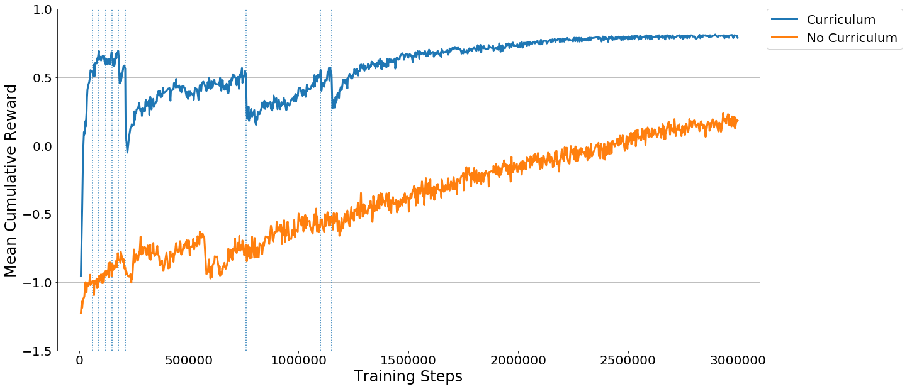

# Training with Curriculum Learning

## Sample Environment

Imagine a task in which an agent needs to scale a wall to arrive at a goal. The
starting point when training an agent to accomplish this task will be a random
policy. That starting policy will have the agent running in circles, and will
likely never, or very rarely scale the wall properly to the achieve the reward.
If we start with a simpler task, such as moving toward an unobstructed goal,
then the agent can easily learn to accomplish the task. From there, we can
slowly add to the difficulty of the task by increasing the size of the wall,
until the agent can complete the initially near-impossible task of scaling the
wall. We are including just such an environment with the ML-Agents toolkit 0.2,
called __Wall Jump__.


_Demonstration of a curriculum training scenario in which a progressively taller
wall obstructs the path to the goal._

To see this in action, observe the two learning curves below. Each displays the
reward over time for an agent trained using PPO with the same set of training
hyperparameters. The difference is that one agent was trained using the
full-height wall version of the task, and the other agent was trained using the
curriculum version of the task. As you can see, without using curriculum
learning the agent has a lot of difficulty. We think that by using well-crafted
curricula, agents trained using reinforcement learning will be able to
accomplish tasks otherwise much more difficult.



## How-To

Each group of Agents under the same `Behavior Name` in an environment can have
a corresponding curriculum. These
curriculums are held in what we call a metacurriculum. A metacurriculum allows
different groups of Agents to follow different curriculums within the same environment.

### Specifying a Metacurriculum

We first create a folder inside `config/curricula/` for the environment we want
to use curriculum learning with. For example, if we were creating a
metacurriculum for Wall Jump, we would create the folder
`config/curricula/wall-jump/`. We will place our curriculums inside this folder.

### Specifying a Curriculum

In order to define a curriculum, the first step is to decide which parameters of
the environment will vary. In the case of the Wall Jump environment, what varies
is the height of the wall. We define this as a `Shared Float Property` that
can be accessed in `Academy.FloatProperties`, and by doing so it becomes
adjustable via the Python API.
Rather than adjusting it by hand, we will create a JSON file which
describes the structure of the curriculum. Within it, we can specify which
points in the training process our wall height will change, either based on the
percentage of training steps which have taken place, or what the average reward
the agent has received in the recent past is. Below is an example curriculum for
the BigWallBehavior in the Wall Jump environment.

```json
{
    "measure" : "progress",
    "thresholds" : [0.1, 0.3, 0.5],
    "min_lesson_length" : 100,
    "signal_smoothing" : true,
    "parameters" :
    {
        "big_wall_min_height" : [0.0, 4.0, 6.0, 8.0],
        "big_wall_max_height" : [4.0, 7.0, 8.0, 8.0]
    }
}
```

* `measure` - What to measure learning progress, and advancement in lessons by.
  * `reward` - Uses a measure received reward.
  * `progress` - Uses ratio of steps/max_steps.
* `thresholds` (float array) - Points in value of `measure` where lesson should
  be increased.
* `min_lesson_length` (int) - The minimum number of episodes that should be
  completed before the lesson can change. If `measure` is set to `reward`, the
  average cumulative reward of the last `min_lesson_length` episodes will be
  used to determine if the lesson should change. Must be nonnegative.

  __Important__: the average reward that is compared to the thresholds is
  different than the mean reward that is logged to the console. For example,
  if `min_lesson_length` is `100`, the lesson will increment after the average
  cumulative reward of the last `100` episodes exceeds the current threshold.
  The mean reward logged to the console is dictated by the `summary_freq`
  parameter in the
  [trainer configuration file](Training-ML-Agents.md#training-config-file).
* `signal_smoothing` (true/false) - Whether to weight the current progress
  measure by previous values.
  * If `true`, weighting will be 0.75 (new) 0.25 (old).
* `parameters` (dictionary of key:string, value:float array) - Corresponds to
  Academy reset parameters to control. Length of each array should be one
  greater than number of thresholds.

Once our curriculum is defined, we have to use the reset parameters we defined
and modify the environment from the Agent's `AgentReset()` function. See
[WallJumpAgent.cs](https://github.com/Unity-Technologies/ml-agents/blob/master/UnitySDK/Assets/ML-Agents/Examples/WallJump/Scripts/WallJumpAgent.cs)
for an example.

We will save this file into our metacurriculum folder with the name of its
corresponding `Behavior Name`. For example, in the Wall Jump environment, there are two
different `Behaviors Name` set via script in `WallJumpAgent.cs`
---BigWallBrainLearning and SmallWallBrainLearning. If we want to define a curriculum for
the BigWallBrainLearning, we will save `BigWallBrainLearning.json` into
`config/curricula/wall-jump/`.

### Training with a Curriculum

Once we have specified our metacurriculum and curriculums, we can launch
`mlagents-learn` using the `–curriculum` flag to point to the metacurriculum
folder and PPO will train using Curriculum Learning. For example, to train
agents in the Wall Jump environment with curriculum learning, we can run

```sh
mlagents-learn config/trainer_config.yaml --curriculum=config/curricula/wall-jump/ --run-id=wall-jump-curriculum --train
```

We can then keep track of the current lessons and progresses via TensorBoard.
